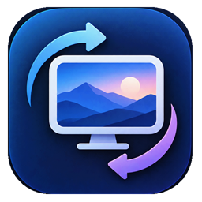

# BackgroundSwitch

<p align="center">
  
</p>

<p align="center">
  <strong>Modern, high-performance Windows desktop wallpaper rotator with per-monitor management, rich curated online providers, frosted glass photo metadata watermarking, and dynamic scheduling.</strong>
</p>

<p align="center">
  
  
  
  
  
  
</p>

---

## 🌟 Key Features

- 🎨 **7 Rich Wallpaper Sources**:
  - **Pexels API**: Hand-curated professional photography tagged by themes (*nature, cyberpunk, architecture, minimal, space, ocean*). Pre-configured ready-to-use API key included.
  - **Bing Daily 4K**: Official Microsoft Bing daily high-resolution landscape photography.
  - **Wallhaven**: World's leading repository for high-resolution 2K/4K/8K anime, digital art, cyberpunk, and fantasy artwork.
  - **NASA APOD**: Astronomy Picture of the Day from Hubble and James Webb Space Telescopes with deep space annotations.
  - **Unsplash Photos**: Stunning real-world high-resolution photography from global contributors.
  - **Reddit Wallpapers**: Top upvoted submissions from `r/wallpapers`, `r/EarthPorn`, `r/spaceporn`, `r/AnimeWallpaper`, and custom subreddits.
  - **Local Folder**: Randomize and loop your own personal photo library with multi-format support (`.jpg`, `.jpeg`, `.png`, `.webp`, `.bmp`).

- 🖥️ **Per-Monitor Multi-Display Topology**:
  - Direct Win32 COM integration (`IDesktopWallpaper`) allows independent rotation for each connected display.
  - Assign distinct keywords, categories, or providers per monitor (e.g., *Cyberpunk on Monitor 1, NASA Space on Monitor 2*).
  - Supports **Synced** (single shared picture), **Per-Monitor** (individual photos), and **Span** (across physical screens).

- ⚡ **Master-Detail 2-Column UX & Instant Preview**:
  - Left column visual list of providers; right column instant configuration panel.
  - **⚡ Test Sample Preview**: Test queries and API keys with 1-click preview directly inside the app without changing your current Windows desktop wallpaper.

- ⏱️ **Live Countdown Timer & Dynamic Scheduling**:
  - Fine-grained switch frequency slider ranging from 1 to 1440 minutes.
  - Quick-preset pills for instant interval switching (`15m`, `30m`, `1h`, `2h`, `4h`, `24h`).
  - Real-time live countdown indicator in the bottom status bar (`⏱️ Next switch in: 14m 32s`).

- 🖼️ **Spotlight Frosted Glass Desktop Watermark**:
  - High-performance SkiaSharp rendering pipeline draws an elegant frosted glass pill badge at the bottom corner of your wallpaper.
  - Displays the photograph's title, artist, and provider source in native screen resolution without blur or distortion.

- 💾 **Smart Rolling Cache & Favorites**:
  - FIFO auto-purging cache prevents disk clutter while enabling smooth offline rotations.
  - 1-click **Add to Favorites** copies full-resolution images into your dedicated collection.
  - Blacklist capability ensures unwanted wallpapers never appear again.

- 🌐 **Instant Bilingual Localization**:
  - On-the-fly switching between **Bilingual (English / Tiếng Việt)**, **English**, and **Tiếng Việt** across the entire UI without restarting.

- 🛸 **Silent Background & System Tray Operation**:
  - Clean minimization to Windows System Tray.
  - Right-click tray menu provides quick actions: *Change Wallpaper Now, Previous Wallpaper, Pause / Resume, Open Favorites, Settings, Exit*.

---

## 🏗️ Architecture

```
BackgroundSwitch/
├── Assets/                 # High-resolution icons and branding assets
├── Common/                 # WPF Converters, RelayCommands, AsyncRelayCommand
├── Models/                 # Configuration, Monitor info, Metadata, Enums
├── Providers/              # Modular image providers (Pexels, Wallhaven, Bing, Nasa, Unsplash, Reddit, Local)
│   ├── IImageProvider.cs
│   └── ImageProviderFactory.cs
├── Services/               # Core business services
│   ├── WallpaperManager.cs         # Win32 IDesktopWallpaper COM interop
│   ├── Scheduler.cs                # Interval timer, countdown, and rotation loop
│   ├── WatermarkService.cs         # SkiaSharp frosted glass badge compositor
│   ├── CacheManager.cs             # FIFO rolling cache and Favorites management
│   ├── BlacklistManager.cs         # SQLite/JSON image blacklisting
│   ├── LocalizationManager.cs      # Bilingual runtime localization dictionary
│   └── TrayIconService.cs          # WinForms NotifyIcon system tray integration
├── ViewModels/             # MVVM ViewModels
│   ├── MainViewModel.cs            # Primary application state and commands
│   └── MonitorItemViewModel.cs     # Per-monitor card state and individual actions
└── Views / MainWindow.xaml # ZeroUI Dark Theme High-Contrast XAML Interface
```

---

## 🚀 Getting Started

### Prerequisites

- **Windows 10** (build 1809 or later) or **Windows 11**
- [.NET 10 SDK](https://dotnet.microsoft.com/download) (or .NET 10 Desktop Runtime)

### Clone and Run

```bash
# Clone the repository
git clone https://github.com/kzxl/BackgroundSwitch.git
cd BackgroundSwitch

# Run development build
dotnet run
```

---

## 📦 Publishing & Deployment

BackgroundSwitch supports two deployment options:

### 1. Lite (Framework-Dependent Single File)
Requires .NET 10 Desktop Runtime installed on the machine. Small footprint (~15MB).

```bash
dotnet publish -c Release -r win-x64 --self-contained false -p:PublishSingleFile=true -o ./publish/lite
```

### 2. Full (Self-Contained Single File)
Standalone executable. Can be copied and run on any modern Windows 64-bit PC without installing .NET Runtime.

```bash
dotnet publish -c Release -r win-x64 --self-contained true -p:PublishSingleFile=true -o ./publish/full
```

---

## 🏷️ GitHub Metadata (Suggested)

### Repository Description
> Modern Windows desktop wallpaper switcher with per-monitor rotation, 7 curated online sources (Pexels, Wallhaven, Bing, NASA, Unsplash, Reddit), frosted glass SkiaSharp watermarks, live countdown timer, and ZeroUI dark theme.

### Repository Topics
`wpf` `dotnet` `csharp` `wallpaper` `wallpaper-switcher` `windows11` `windows10` `per-monitor` `wallhaven` `pexels-api` `bing-wallpaper` `nasa-apod` `unsplash` `reddit-wallpaper` `skiasharp` `zeroui` `system-tray` `dark-theme`

---

## 📄 License

This project is licensed under the [MIT License](LICENSE).
